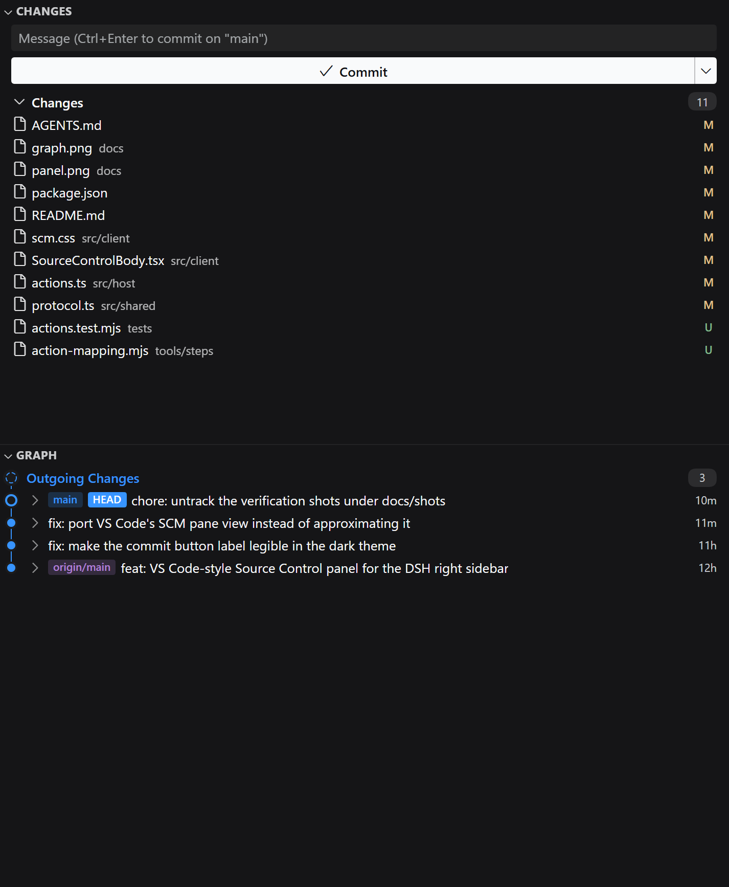
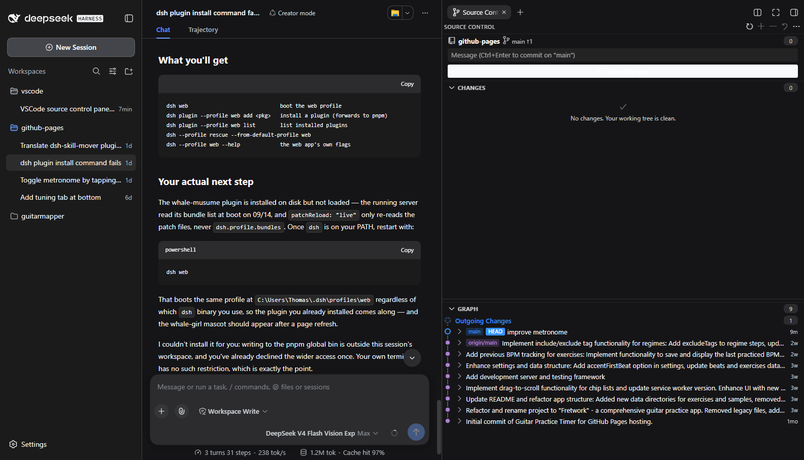

# dsh-plugin-source-control

A Source Control panel for the [DeepSeek Harness](https://github.com/deepseek-ai/deepseek-harness) web
client: a port of VS Code's Source Control view into the right Sidebar — the **Changes** and **Graph**
views stacked in one tab — with a real [Monaco](https://github.com/microsoft/monaco-editor) diff editor
beside it.

The panel lives where the file explorer lives. Clicking a changed file arranges the column so the diff
opens **to the left of the file list**, the way VS Code puts the diff editor next to the side bar.



## What it registers

The plugin is one tab *type* in the right Sidebar's registry, plus the body and chip that draw it:

| Registration | What it is |
|---|---|
| `ctx.sidebarRightTabs.register({ kind: 'sourceControl' })` | The page type, with a guide entry so the Guide page offers it. |
| `ctx.sidebarRightTabs.register({ kind: 'sourceControlDiff' })` | The resource type that claims `dsh-resource://git-diff/**` and hosts the diff editor. |
| `sidebar.right.pane.tab` (keyed by the type id) | The panel body and the diff body. |
| `sidebar.right.pane.tab.title` (keyed by the type id) | The tab chips. |
| `ctx.webServer.register({ kind: 'prefix', path: '/source-control' })` | The Host half's JSON surface and the bundled Monaco editor worker. |

Because the type contributes a guide entry, the right Sidebar's default page becomes the Guide
(the shipped Files type plus this one) rather than Files opening directly. That is the documented
behaviour for a column with more than one guide entry.

## Install

The plugin is a DSH **bundle plugin**. From a checkout of this directory:

```sh
pnpm install
pnpm build            # emits lib/index.js, lib/client.js, lib/monaco-editor.worker.js
dsh plugin --profile web add link:$PWD
```

`dsh plugin add` records the dependency and appends the bundle to `dsh.profile.bundles`, so the plugin
mounts on the next `dsh --profile web` start. Verify the composed tree with:

```sh
dsh --profile web --dump-config | grep -A4 source-control
```

The Host half is loaded at startup, so a restart (not just a page reload) is what activates it. A page
reload on its own moves only the panel, and the two halves then disagree about what the other knows:
the panel will say so plainly — `Unknown Source Control action: sync. The plugin host half is probably an
older build than the panel — restart the server.`

## Configuration

`cordis.patch.yml` inserts the row; override its config from any later layer:

```yaml
- insert:
    - id: source-control
      name: dsh-plugin-source-control
      config:
        # mixed   — untracked files are listed inside "Changes" (VS Code's default)
        # separate — they get their own "Untracked Changes" group
        # hidden   — they are not collected at all
        untrackedChanges: mixed
        # Repository-relative paths never listed.
        exclude: []
```

## What the panel does

The tab is VS Code's Source Control **view container**: two panes — **Changes** on top and **Graph**
below — each with the same 22px `.pane-header` VS Code gives a view, and the same sash floated over the
boundary between them. Fold either pane from its header and the other takes the whole column: a folded
pane is pinned to its header, exactly as `Pane.minimumSize === Pane.maximumSize === headerSize` pins it
in VS Code, so the folded Graph ends up at the *bottom* of the column rather than above a blank gap.
Drag the sash to move the boundary, or double-click it to give the two panes half the column each.

There is no separate toolbar and no repository row, because VS Code draws neither: the container's title
area is the tab strip above this panel (and Source Control contributes no actions to it), and with a
single repository the Changes view is the commit box, its button, and the resource groups. The branch
lives in the commit box's placeholder and the ahead/behind counts ride on the button, where git's action
button puts them.

**Changes** follows VS Code's git provider: `Merge Changes`, `Staged Changes`, `Changes`, and (under
`untrackedChanges: separate`) `Untracked Changes`. A file changed on both sides appears once per side,
exactly as VS Code lists it. Rows show the file name, the dimmed directory, and the status letter in
VS Code's own git decoration colours — `M` modified, `A` added, `D` deleted (struck through), `R`
renamed, `C` copied, `U` untracked, `T` type changed, `!` conflicted.

**Actions.** Per file: Open Changes, Discard Changes, Stage Changes, Unstage Changes, Add to
`.gitignore` for untracked files. Per group: Stage All, Unstage All, Discard All. Per pane: Refresh and
More Actions (Fetch, Pull, Push, Sync Changes, Collapse All, Expand All, Stage All, Unstage All,
Discard All) — in the Changes header, where VS Code puts them, revealed while that pane is hovered.

The commit box commits on `Ctrl+Enter`, and the one button above it is git's action button, with git's
own labels, icons and priority: changes to commit win it (**Commit**, or **Continue** during a merge),
then a branch with no upstream offers **Publish Branch** (`git push --set-upstream <remote> <branch>`),
then a branch out of step with its upstream offers **Sync Changes** — which is a real sync, a pull
**and then** a push, with the ahead/behind counts on the button — and otherwise it is Commit, disabled.
The tooltips are git's too, down to the wording of the sync one.

Discarding always asks first — it reverts tracked edits and deletes untracked files, and the
repository cannot undo it.

**Graph** draws the commit history: a lane gutter with one coloured line per branch, a node per commit,
and the branch, remote and tag references as chips on the commit that carries them. `Incoming Changes`
and `Outgoing Changes` appear above the history when the branch is behind or ahead of its upstream.
Each commit expands to the files it changed, and clicking one opens that file's diff for that commit
(`<hash>^` against `<hash>`) in the pane to the left.

The Graph is **ported from VS Code**, not reimplemented: `src/client/graph.ts` carries
`toISCMHistoryItemViewModelArray` (the swimlane model), `compareHistoryItemRefs`, and
`renderSCMHistoryItemGraph` with its draw helpers, essentially verbatim from
`src/vs/workbench/contrib/scm/browser/scmHistory.ts` (MIT, © Microsoft Corporation), together with the
matching rules from that extension's `scm.css`. Only the colour plumbing is adapted, because this panel
has no theme-colour registry. The node shapes come from the original's stroke/fill pairing — every
circle is stroked in the row's background colour so the lanes do not run into it, and the last circle of
a HEAD / incoming / outgoing node is filled with it too. That is what makes **HEAD a hollow ring**,
incoming and outgoing changes **dashed rings**, a merge a ringed disc, and an ordinary commit a solid
dot.

The swimlane model is the one piece of this whose correctness is not visible by looking — a wrong lane
still draws *something* — so it is pinned by `pnpm test` against linear, merged, diverged, in-step, and
empty histories.



**The diff editor** compares the pair VS Code compares: HEAD against the index for a staged change,
the index (or HEAD when nothing is staged) against the working tree for an unstaged one, nothing
against the file for an untracked one, "ours" against "theirs" for a conflict, and a commit's parent
against the commit for a file opened from the Graph. It is a real Monaco diff editor, read-only, side
by side, with the plugin's theme derived from the DeepSeek Harness alias tokens. Roughly 90 languages
are tokenised through Monaco's basic-languages set.

Every diff is recorded at **one** address, so clicking another file re-points the diff that is already
on screen instead of stacking a tab per file — the preview behaviour VS Code's diff editors have. One
diff tab, one Monaco instance, re-navigated in place.

## How it is put together

```
src/
├── index.ts                 Host plugin: config schema + the HTTP surface
├── host/
│   ├── api.ts               routes: /api/status, /api/diff, /api/action, /api/history, /api/commit, the Monaco worker
│   ├── git.ts               git through the subprocess seam (argv, never a shell string)
│   ├── status.ts            porcelain v1 parsing and group assembly
│   ├── history.ts           git log and git show parsing for the Graph
│   ├── diff.ts              revision resolution and language detection
│   └── actions.ts           stage / unstage / discard / commit / push / ignore
├── client/
│   ├── index.ts             tab types, seats, style installation, the diff-opener
│   ├── SourceControlBody.tsx  the panel: the two panes, their headers, and the commit box
│   ├── GraphSection.tsx       the Graph view
│   ├── graph.ts               VS Code's swimlane model + SVG renderer, ported (unit-tested)
│   ├── DiffBody.tsx           the Monaco diff pane
│   ├── monaco.ts              Monaco + the Harness-derived theme + worker wiring
│   └── editor.worker.ts       the worker entry, bundled and served by the Host half
└── shared/                  the wire contract both halves compile against
```

**Working on this code?** Read [AGENTS.md](AGENTS.md) first — it covers the architecture rules, the
traps that have already cost time, and how to verify a change in a real browser without disturbing a
running server.

Two decisions are worth knowing:

- **The browser never touches the repository.** Every read and write is a JSON call to the Host half,
  which runs git through `ctx.subprocess`. Paths are passed as argv elements, so nothing is quoted into
  a shell.
- **Monaco is a real dependency, bundled.** `build.mjs` bundles `monaco-editor`'s editor core plus the
  basic languages with esbuild, embeds the collected stylesheet in the client bundle, and wraps the
  result in the client module system's `__ModuleLoader__.load` envelope. The editor worker is a second
  esbuild entry the Host half serves from `/source-control/monaco/editor.worker.js`.

## Known limitations

- **The Graph lists, it does not edit.** No blame, no stashes, no branches/remotes/tags UI, no
  multi-file diff editor, and no paging past the newest 150 commits.
- **Renames read as two rows.** The commit file list is read with `--no-renames`, so a rename shows as
  a deletion plus an addition; each half still opens a correct diff.
- **A single repository per session**, resolved from the session's working directory.
- **List view only.** VS Code's tree view, its sort keys, and its file-icon themes are not implemented.
- **No repository row.** VS Code only draws one with more than one repository (or
  `scm.alwaysShowRepositories`), and this panel has exactly one repository per session; the branch and
  the ahead/behind counts are shown where VS Code shows them instead.
- **No file watching.** The Changes view re-reads the repository every four seconds while it is on
  screen; the Graph is read on mount, on demand, and after every write.
- **No untracked-directory deletion toggle.** Discard All passes `-d` to `git clean`, as VS Code does.
- **Windows-friendly, not Windows-only.** Paths are passed as argv, so separators never need escaping.

## Licence

MIT. Monaco is MIT (Microsoft); the codicon font it and this plugin use is MIT
([`@vscode/codicons`](https://github.com/microsoft/vscode-codicons)).
